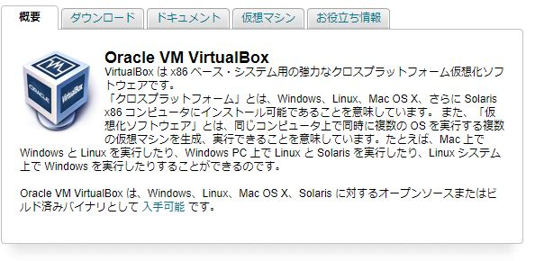
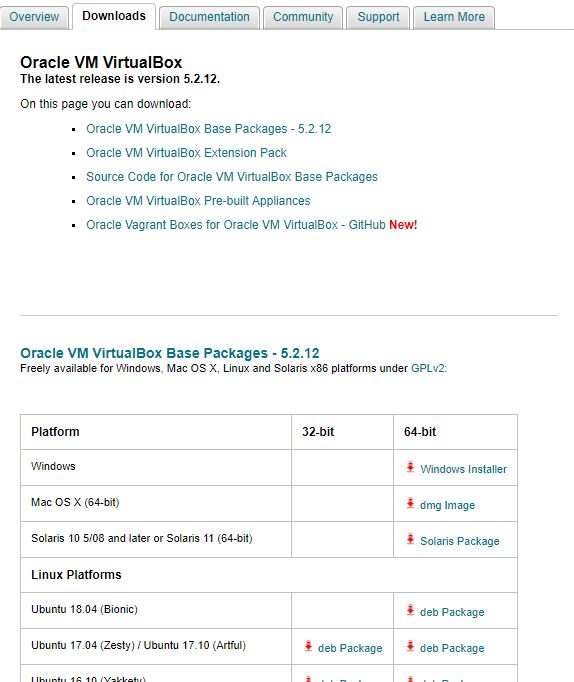
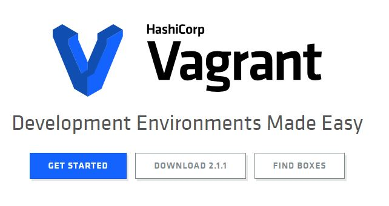
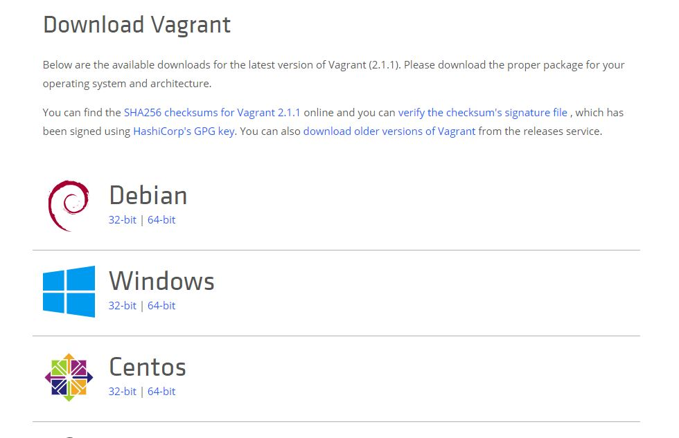
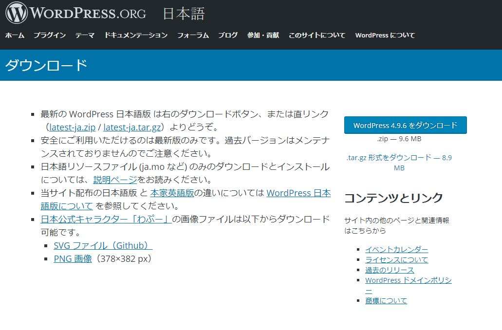
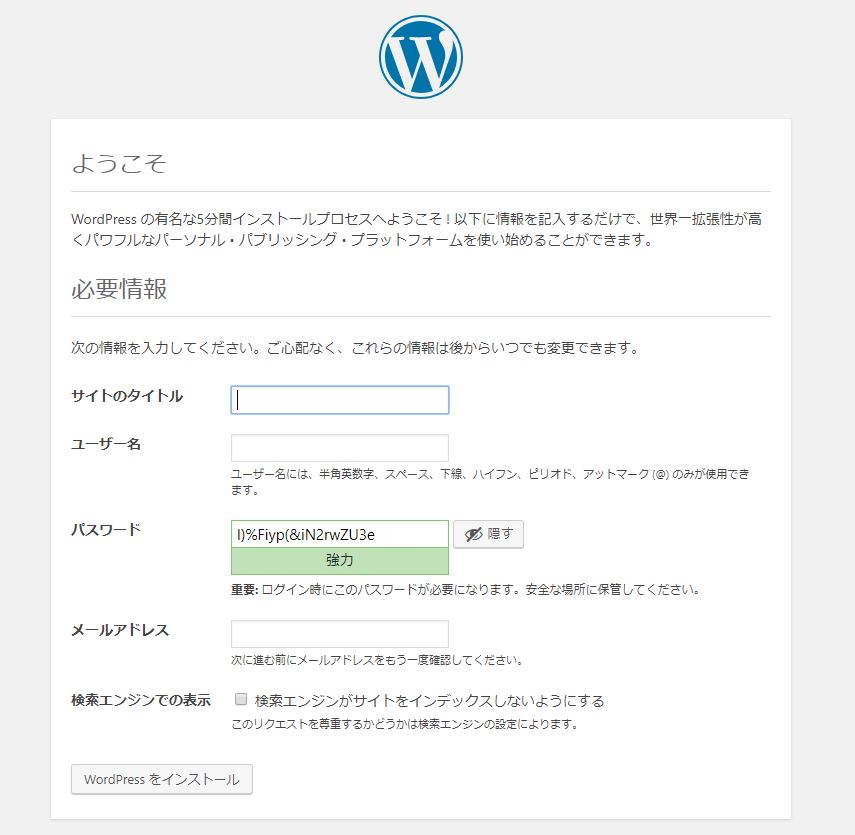

# WinマシンからのWordPress開発環境構築手順

---

## 1. ヴァーチャルマシン(VM)環境の構築

  - ##### VMの用途とは  
    サーバー環境を作るため。  
    テスト環境でLinux環境をハードウェア的に用意するコストが発生する場合、仮想環境にてエミュレートするローコストな手段を取ることができる。  

  - ##### 導入ツール  

  [Oracle VM VirtualBox](http://www.oracle.com/technetwork/jp/server-storage/virtualbox/overview/index.html)  
  クロスプラットフォーム仮想化ソフトウェア。  
  WindowsでLinux環境をエミュレートできるが、設定が面倒。  

  [Vagrant](https://www.vagrantup.com/)  
  VMの環境を簡単に構築したり、他のメンバーに設定を受け渡しできるようになる。  

  - ##### 導入手順  
    1. **Oracle VM VirtualBox のインストール**  

      「ダウンロード」or「入手可能」よりダウンロードページに移行  
        
      http://www.oracle.com/technetwork/jp/server-storage/virtualbox/overview/index.html  

      「Platform」より「Windows」を選択する。        
        

      その後、マシンにダウンロードされた「VirtualBox-X.X.XX-XXXXXX-Win.exe」を実行。  
      インストールフォルダのファイルパスを指定などの予定がなければすべてYesで問題ない。
    2. **Vagrant のインストール**  

      「DOWNLOAD X.X.X」をクリック    
        
      https://www.vagrantup.com/  

      「Windows」の「64bit」を選択。
        
      その後、マシンにダウンロードされた「vagrant_X.X.X_x86_64.msi」を実行。  
      こちらも特に問題なければすべてYesで問題ない。  
      マシンの再起動が促されるので、再起動を行う。  

      適当な場所でコマンドプロンプトを開き、``vagrant -v``すると   
      ``Vagrant 2.1.1``と返ってくるならインストール成功。
    3. **Boxイメージの確認**  

        
      https://app.vagrantup.com/boxes/search  

      Vagrantのイメージファイルを検索しておく。  
      今回は以下のイメージファイルを使用する。  
        
      https://app.vagrantup.com/bento/boxes/centos-7.2  
    4. **Vagrant初期化**  

      先ずは、Vagrantのフォルダ＆OSイメージのフォルダを作成。  
      (容量が大きくなる可能性があるのでフォルダに注意)  
        

      フォルダに移動後、コマンドプロンプトにてVagrantを初期化。  
      ⇒``vagrant init bento/centos-7.2``  
      当該ディレクトリに「Vagrantfile」が作成されるので編集する。   
        

    5. **Vagrantfileの編集**  

      ```Bash
      # -*- mode: ruby -*-
      # vi: set ft=ruby :

      # All Vagrant configuration is done below. The "2" in Vagrant.configure
      # configures the configuration version (we support older styles for
      # backwards compatibility). Please don't change it unless you know what
      # you're doing.
      Vagrant.configure("2") do |config|
        # The most common configuration options are documented and commented below.
        # For a complete reference, please see the online documentation at
        # https://docs.vagrantup.com.

        # Every Vagrant development environment requires a box. You can search for
        # boxes at https://vagrantcloud.com/search.
        config.vm.box = "bento/centos-7.2"

        # Disable automatic box update checking. If you disable this, then
        # boxes will only be checked for updates when the user runs
        # `vagrant box outdated`. This is not recommended.
        # config.vm.box_check_update = false

        # Create a forwarded port mapping which allows access to a specific port
        # within the machine from a port on the host machine. In the example below,
        # accessing "localhost:8080" will access port 80 on the guest machine.
        # NOTE: This will enable public access to the opened port
        # config.vm.network "forwarded_port", guest: 80, host: 8080

        # Create a forwarded port mapping which allows access to a specific port
        # within the machine from a port on the host machine and only allow access
        # via 127.0.0.1 to disable public access
        # config.vm.network "forwarded_port", guest: 80, host: 8080, host_ip: "127.0.0.1"

        # Create a private network, which allows host-only access to the machine
        # using a specific IP.
        config.vm.network "private_network", ip: "192.168.33.10"

        # ↑このコメントアウトを解除
        # 「VBoxManage.exe: error: Failed to create the host-only adapter」
        # が発生した場合はIPを変えてみること

        # Create a public network, which generally matched to bridged network.
        # Bridged networks make the machine appear as another physical device on
        # your network.
        # config.vm.network "public_network"

        # Share an additional folder to the guest VM. The first argument is
        # the path on the host to the actual folder. The second argument is
        # the path on the guest to mount the folder. And the optional third
        # argument is a set of non-required options.
        # config.vm.synced_folder "../data", "/vagrant_data"

        # Provider-specific configuration so you can fine-tune various
        # backing providers for Vagrant. These expose provider-specific options.
        # Example for VirtualBox:
        #
        # config.vm.provider "virtualbox" do |vb|
        #   # Display the VirtualBox GUI when booting the machine
        #   vb.gui = true
        #
        #   # Customize the amount of memory on the VM:
        #   vb.memory = "1024"
        # end
        #
        # View the documentation for the provider you are using for more
        # information on available options.

        # Enable provisioning with a shell script. Additional provisioners such as
        # Puppet, Chef, Ansible, Salt, and Docker are also available. Please see the
        # documentation for more information about their specific syntax and use.
        # config.vm.provision "shell", inline: <<-SHELL
        #   apt-get update
        #   apt-get install -y apache2
        # SHELL
      end
      ```
    6. **Vagrant起動＆接続**  
      コマンドは```vagrant up```。  
      初回起動時はダウンロードが入るので時間がかかる。  

      ssh通信で接続する場合は、```vagrant ssh```。  
        
      ```
      [Vagrant@localhost ~]$
      ```
      が出ていれば接続OK。  

      ついでに``$ sudo yum update``でアップデートもかけておく  

    7. **パッケージのインストール(1) nginx**  

      nginxのリポジトリをインストールする。
      ```
      $ sudo yum install http://nginx.org/packages/centos/7/noarch/RPMS/nginx-release-centos-7-0.el7.ngx.noarch.rpm
      ```  
      「/etc/yum.repos.d/nginx.repo」を以下に書き換えする。  
      ```
      [nginx]
      name=nginx repo
      baseurl=http://nginx.org/packages/mainline/centos/7/$basearch/
      gpgcheck=0
      enabled=0
      ```  
      リポジトリの確認＆nginxのインストール。  
      ```
      $ sudo yum info --enablerepo=nginx nginx
      $ sudo yum -y install --enablerepo=nginx nginx
      ```  
      バージョン確認を行い、正常にバージョンが表示されればインストール完了。
      ```
      $ nginx -v
      nginx version: nginx/1.9.12
      ```  
      nginxの初期設定を行う。  
      デフォルトで「/etc/nginx/conf.d」に「default.conf」という
      設定ファイルが存在するので編集。  
      ```
      $ cd /etc/nginx/conf.d
      $ sudo vi default.conf
      ```  
      ```
      server {
        listen 80;                // 待ち受けするポート
        server_name www.tests.kj; // サーバーの名前
        location / {
        root    /var/www/www.tests.kj; // サーバーのルートディレクトリ
        index   index.html index.htm;  //接続初期に読み込むファイル
        }
      }
      ```  

      下記はnginxのよく使うであろうコマンド。  
      開始    ```$ sudo systemctl start nginx```  
      停止    ```$ sudo systemctl stop nginx```  
      再起動   ```$ sudo systemctl restart nginx```  
      状態確認 ```$ sudo systemctl status nginx```  

    8. **hostsファイルにてVMと接続**  
      Win機に戻り、以下のディレクトリに移動。   
      C:\Windows\System32\drivers\etc  

      hostsファイルが存在するので、エディタで以下を編集。  
      ```
                    ↓ nginxで設定したホスト名
      192.168.1.10 www.tests.kj
      ↑ Vagrantfileで設定したIPアドレス
      ```
      ⇒中身はテキストなのでテキストエディタで編集可能。  

      ※パーミッションが必要になるフォルダなので、以下の方法で編集を勧める。  
      1.管理者権限で起動したメモ帳で、hostsファイルを開く  
      2.hostsファイルをどこかにコピー＆編集し、編集したファイルを戻して上書き  

      ※ネットワーク接続に関わるファイルなので、編集後は必ず元の設定に戻すこと。  
        また、ウィルスバスターで読み込みが禁止される場合もある。  
        筆者環境のAviraでhostsファイルを読み込まないようになっていたため、接続できなかった。  

      VMに戻り、nginxで設定したルートディレクトリにテスト用のHTMLを入れる。  
      ⇒もしもルートディレクトリが存在していなければ、作成しておく。  
      ```  
        $ sudo mkdir -p /var/www/www.tests.kj
        $ sudo vi /var/www/www.tests.kj/index.html
        Hello!
      ```

      Win機に戻り、ブラウザにて「 http://www.tests.kj 」にアクセス。  
      以下のように表示されれば、接続成功。  
        

    9.  **パッケージのインストール(2)  MySQL**  
        ※CentOS7より、「MariaDB」がデフォルトになっているのでアンインストール。  
        ```
        $ sudo yum remove mariadb-libs
        $ sudo rm -rf /var/lib/mysql
        ```  
        その後、MySQL公式のyumリポジトリを追加する。  
        https://dev.mysql.com/downloads/repo/yum/
        ```
        $ sudo rpm -ivh http://dev.mysql.com/get/mysql57-community-release-el7-8.noarch.rpm
        ```  
        追加が完了したら、yumにてMySQLをインストール。
        ```
        $ sudo yum install mysql-community-server
        ```  
        バージョン確認にて、以下のように表示されればインストール完了。  
        ```
        $ mysqld --version
        mysqld  Ver 5.7.22 for Linux on x86_64 (MySQL Community Server (GPL))
        ```  
        MySQLのデーモンを起動させる。  
        毎回起動時にMySQLを起動させるのが手間なら、2個目のコマンドを入力し「マシン起動時自動スタート」を有効にする。  
        ```
        $ sudo service mysqld start
        $ sudo chkconfig mysqld on
        ```
        ※MySQL初回起動時のみ  
        MySQLのインストール時仮パスワードを確認する。
        ```  
        $ cat /var/log/mysqld.log | grep 'password is generated'
        2018-06-02T04:05:29.289958Z 1 [Note] A temporary password is generated for root@localhost: o%fl1t7fFHXg
        ```  
        仮パスワードが「o%fl1t7fFHXg」である事が確認できたため、パスワード入力でMySQLを起動。  
        ```
        $ mysql -u root -p
        ```
        ユーザーパスワードを設定。以降はこのパスワードにてログインする。  
        ```
        SET PASSWORD = 'TestKJWp_1';
        ```  
        MySQLにWordPress用のデータベースを作成する。  
        ⇒WordPressはMySQLとかMariaDBとかのデータベースを使用するため。

        ```
        create database wordpress;
        grant all on wordpress.* to dbuser@localhost identified by 'KJWordpress_1';
        ```  
        上記操作で、

        データベース名 ：wordpress  
        ユーザー名     ：dbuser  
        パスワード     ：KJWordpress_1  

        のデータベースが作成されたので、exitにてMySQLを抜ける。  

    10. **パッケージのインストール(3)  php**  

        PHPと関連パッケージをインストール。  
        (Wgetは後述のWordPressの為についでに先行してインストール)  
        ```
        $ sudo yum install php php-mysql wget
        $ sudo yum -y install php-fpm
        ```  
        php-fpm(CGIのマネージャー)の設定をnginx使用に変更する。  
        ```
        $ sudo vi /etc/php-fpm.d/www.conf
        ```  
        設定ファイル内の以下の箇所を「nginx」に書き換え。  
        ```
        user = nginx
        group = nginx
        ```  
        設定の反映のためパッケージを再起動する。
        ```
        sudo systemctl restart php-fpm
        sudo systemctl restart nginx
        ```
    11. **パッケージのインストール(4)  WordPress**  

        [WordPressの公式サイト](https://ja.wordpress.org/download/)から、最新版のWordPressの圧縮ファイルのリンクを調べる。  
        ⇒tar.gzの方が取り扱いが楽？

          

        VMにて、圧縮ファイルをダウンロード＆解凍。  
        ```
        $ wget https://ja.wordpress.org/wordpress-4.9.6-ja.tar.gz
        $ tar zxf wordpress-4.9.6-ja.tar.gz
        ```
        解凍したファイルをルートディレクトリに移動。  
        ```
        $ sudo mv wordpress /var/www/www.tests.kj/
        ```  

        WordPressの設定ファイルを編集し、MySQLと関連付ける。  
        「wp-config.php」が設定ファイルになるのだが、初期は「wp-config-sample.php」となっているので、別名でコピーする。  
        ```
        $ cd /var/www/www.tests.kj/wordpress
        $ cp wp-config-sample.php wp-config.php
        $ vi wp-config.php  
        ```  
        wp-config.phpの下記部分を編集。  
        MySQLで作成したデータベース情報を記入していく。  
        ```php:wp-config.php
        // ** MySQL 設定 - この情報はホスティング先から入手してください。 ** //
        /** WordPress のためのデータベース名 */
        define('DB_NAME', 'wordpress');

        /** MySQL データベースのユーザー名 */

        define('DB_USER', 'dbuser');

        /** MySQL データベースのパスワード */

        define('DB_PASSWORD', 'KJWordpress_1');
        ```

        また、下記部分にランダムな文字列を求められる。  
        [WordPressの秘密鍵サービス](https://api.wordpress.org/secret-key/1.1/salt/)にてランダム生成すると楽。  
        ```php:wp-config.php        
        define('AUTH_KEY',         'lv+mB-Pl$S+5Hvhw8OnS>-K) U.sdM}Rz?EVv<f00[~}|IL/Fe3N8asQ;G^b-qLY');
        define('SECURE_AUTH_KEY',  'oiI*iz+q&%>@e0gE8i+SV^:3T|%P V<`5(|)7S-eR&C-zvf8f2~%vk%z77TFV#kr');
        define('LOGGED_IN_KEY',    'k5{l4?[S!Xx-28[0Pf:`p-N+Spvo`G-t<-=YF_x+KQ_7]lQCB#BRTO<Plb3AZT|J');
        define('NONCE_KEY',        '&C?Xg-aQ}>K&s9zCFQxGT:|y:nGrp?vheo5|k[coGENLQuxKPb(CK}0P4iZ;b.K]');
        define('AUTH_SALT',        'P&OFQ5sR!t0.3 d-$+/Beur(Osi0U958^4hHECgeiU>pSa#Q+Kd5GhUW} ( {+h}');
        define('SECURE_AUTH_SALT', '9?ow.-$Fu<WilxOU,>MEM|T[[^+l|V*e2V5 w:q$Fx+d^^2U([FMdm?| v7TtZpZ');
        define('LOGGED_IN_SALT',   'z>xFJ,CcERd_@+WA3Kf2g)q/USHSU!+Y WicC aYaC%mvuG9cG/mCv%GYoe)tKq/');
        define('NONCE_SALT',       ',U`Zj%,$:Y6<4W+[r$+.P)<ydq8+xN@^Sfb|.fq(}V}0LHYThSO-IA^#d--B7i~F');
        ```  

        nginxの設定もWordPressのphpを読み込むように対応させる。  
        ```
        $ cd /etc/nginx/conf.d
        $ sudo vi default.conf
        ```  
        下記のように「location ~ \.php$」を追加。   
        ```
        server {
          listen 80;                // 待ち受けするポート
          server_name www.tests.kj; // サーバーの名前
          location / {
          root    /var/www/www.tests.kj/wordpress; // サーバーのルートディレクトリ
          index   index.html index.htm index.php;  //接続初期に読み込むファイル
          }
          location ~ \.php$ {
            root           /var/www/www.tests.kj/wordpress;
            fastcgi_pass   127.0.0.1:9000;
            fastcgi_index  index.php;
            fastcgi_param  SCRIPT_FILENAME  $document_root$fastcgi_script_name;
            include        fastcgi_params;
          }
        }
        ```  

        Win機に戻り、ブラウザにて「 http://www.tests.kj 」にアクセス。。  
        以下のように表示されれば、環境構築終了。  
          
